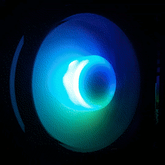
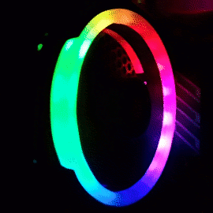

# RGBHardwareMonitor


[][donation url]

**RGBHardwareMonitor** is an utility that allows displaying RGB lights effects based on your computer hardware temperatures or other sensor data.
It relies on **OpenHardwareMonitor** to query sensors values or other hardware monitoring information, then sends this information to an **Arduino** connected via USB, which in turn displays light effects on connected RGB led strips.

## DISCLAIMER
This project is currently in alpha stage. Structure, specifications and code can radically change at any time.

## Demo
This is how the effects look on my RGB fans:

<a href="url"></a>
<a href="url"></a>
<a href="url"></a>

## Prerequisites


  - **[OpenHardwareMonitor](http://openhardwaremonitor.org/)**  
    Needs to be either extracted/installed to a permanent location or already running.

  - **Arduino**  
    An Arduino UNO (or other compatible microcontroller with same or better specs) is needed to interface to the RGB led strips, using the included sketch

  - **RGB light strips or fans**  
    Connected to the arduino

## Installation

Download the latest releasefrom the [release][releases url] section of this GitHub repo.
Pre-built binary releases are available in both installable or portable versions.

Only Windows operating system is currently supported.

## Configuration

The configuration file _config.ini_ can be found in the program's folder (default _%ProgramFiles%\RGBHardwareMonitor_). These are the main variables that can be specified:
 
  - **`[RGBHardwareMonitor]`** section:
      - **`openhardwaremonitor_path`**: defines the executable path of OpenHardwareMonitor, used to auto-start OHW if it's not running already
      - **`arduino_serial_id`**: defines the USB serial ID of the arduino (_VID:PID_), used to identify the serial port for the arduino connection
      - **`log_file`**: specifies a log file for debugging/logging purposes
      - **`log_level`**: specifies the verbosity level for the logging output (accepted values: `CRITICAL`, `ERROR`, `WARNING`, `INFO`, `DEBUG`)
      - **`verbosity`**: specifies the verbosity level for console output (this option has no effect when using the pre-built binaries as the terminal window is hidden by default)
    
  - **`[RingLight#]`** section(s):  
    These section(s) define the various _RingLights_ effects, currently the only supported. Multiple RingLights are supported by the arduino code, and can be specified using an unique index for each (eg. `[RingLight1`, `[RingLight2]`, ...). They should conceptually identify a single hardware component for which to display temperature, load and fan speed.
      - **`name`**: a human-readable name for the related hardware component (eg. `CPU` or `GPU`)
  
  - **`[RingLight#.{Type}Sensor]`** subsections:  
    These "subsections" are used to specify the sensors data source and value ranges for _temperature_, _load_, and _fan_ for the _RingLight_ (respectively: `[RingLight#.TempSensor]`, `[RingLight#.LoadSensor]`, `[RingLight#.FanSensor]`)
      - **`device`**: the device (from OpenHardwareMonitor) providing the sensors (accepted values: `mainboard`, `superio`, `cpu`, `ram`, `hdd`, `gpu`)
      - **`filter_{type}`**: one or more filters are used to select the correct sensor for the device from OpenHardwareMonitor. The available filters are `filter_name`, `filter_identifier`, `filter_sensor_type`. The available values for the filters can be obtained by right-clicking the tray icon and selecting "Show hardware info".
      - **`range_min`** and **`range_max`**: the "raw" values from the sensor that will be mapped to min (=0) and max (=100). Can be used to trigger some light effects only above certain thresholds (eg. temperature, cool at `range_min: 30.0`, hot at `range_max: 70.0`)
   
The default config file included should be edited to accomodate your custom setup before running the program for the first time.

## Arduino setup

The arduino code can be found in the `arduino/rgb_temps` folder inside the program folder.

## Usage

Just run from the start menu (install version) or RGBHardwareMonitor.exe from the program folder (portable version).

The program runs from the taskbar tray and right-clicking the icon displays a menu with options.

## Contributing

Pull requests are welcome. For major changes, please open an issue first to discuss what you would like to change.

<!--Please make sure to update tests as appropriate.-->

This repo uses a submodule for the systray library from . Clone with:
```bash
git clone https://github.com/andreabak/RGBHardwareMonitor
cd RGBHardwareMonitor
git submodule init
git submodule update
```

### Requirements / dependecies
 - [OpenHardwareMonitor](http://openhardwaremonitor.org/)
 - Python (_>=3.7_)
 - WMI (_>=1,<2_)
 - pySerial (_>=3,<4_)
 - PyWin32 (_>=220_)
 - PyInstaller (_>=3,<5_): used for binaries and releases building

### Building

Use the included `build_release.py` to build binary releases.

## Acknowledgments

This project was originally born from a fork of <https://github.com/AndresCidoncha/VisualHardwareAlarm>, and then mostly rewritten.

## Licence

Released under .

## Donations

Donate to the project maintainer:

[][donation url]

<!--REFERENCES-->

[releases url]: https://github.com/andreabak/RGBHardwareMonitor/releases
[donation url]: https://www.paypal.com/cgi-bin/webscr?cmd=_donations&business=PCYKW7DB34WQ4&item_name=donate+to+RGBHardwareMonitor+project+maintainer&currency_code=EUR&source=url
